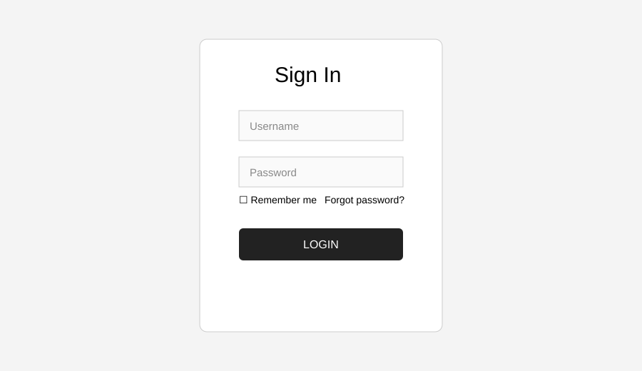
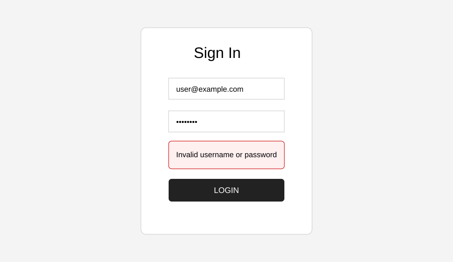
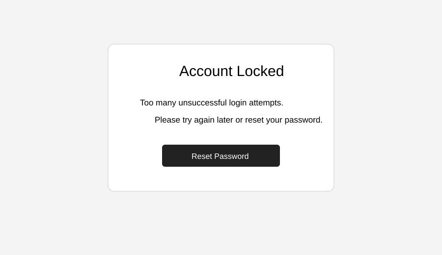

# 🔐 Login & Authentication Testing

Manual QA portfolio project focused on authentication, authorization and session-management scenarios for a web application.

## Coverage
- Valid/invalid login
- Empty field validation
- Password masking
- Forgot password
- Account lockout
- Remember-me/session behavior
- Logout
- Authorization/access control
- Boundary and negative testing
- Basic security-oriented checks

## Structure
```text
Login-Authentication-Testing/
├── README.md
├── Test-Cases/Login_Test_Cases.md
├── Bug-Reports/Authentication_Bug_Reports.md
├── Test-Data/login_test_data.csv
├── Test-Plan/Test_Plan.md
└── Screenshots/
    ├── login-page.svg
    ├── invalid-login.svg
    └── account-lockout.svg
```

## Screenshots






> Screenshots are documentation mockups created for this portfolio project; they are not presented as production-system execution evidence.

## Sample Scenarios
| ID | Scenario | Expected |
|---|---|---|
| AUTH-001 | Valid credentials | User reaches dashboard |
| AUTH-002 | Wrong password | Error shown, no login |
| AUTH-003 | Blank username | Required-field validation |
| AUTH-004 | Multiple failed attempts | Account lock/rate-limit behavior |
| AUTH-005 | Logout | Session invalidated |
| AUTH-006 | Direct protected URL | Unauthorized user is blocked |

## Tools
Manual Testing • Test Cases • Bug Reporting • Browser DevTools

**Author:** Keerthi Kandula
